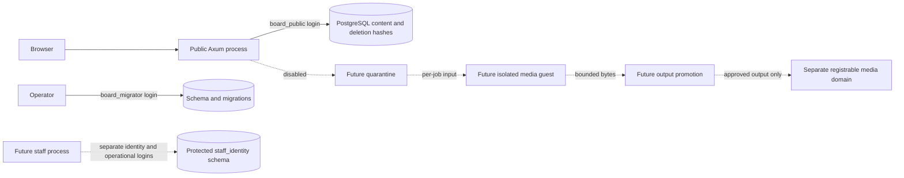

# Architecture and threat model

The implemented domain is a modular monolith: `board-domain` owns identifiers, posting validation and formatting; `board-config` validates origins and runtime configuration; `board-store` owns bound SQL and transactions; `board-public` serves Axum routes and escaped Askama templates. `board-migrate` is an operator binary. First-party crates forbid unsafe Rust.

Dashed flows are required future work, not deployed services. There is no media processor, job coordinator, quarantine collection or promoter in this milestone. No ordinary container is claimed to substitute for a microVM.

## Identities and authority

| Identity | Actual authority | Already-compromised component implications |
|---|---|---|
| Public application / `board_public` | Select content and deletion hashes; insert posts/reports; update thread counters/timestamps/deletion and post deletion; limited board row-lock grant | Can read retained deleted text and password hashes, corrupt public content, submit reports and consume its database resources. Cannot select staff/auth data or reports, update staff roles, assume migration identity, create schemas or read deployment settings. Those denials are tested against real PostgreSQL logins. |
| `board_migrator` | Database owner and schema maintenance, outside public runtime | Can change data/grants; never include it in either web service's environment. The migration CLI verifies its login. |
| `board_staff` | NOLOGIN role reserved for content review and specific moderation columns | No runnable staff service. It has no identity/auth schema or deployment grants. Operational authority needs authenticated audited handlers before use. |
| `board_auth` | NOLOGIN role reserved for identity tables | Independent schema authority, no public content grant. No enrollment/session/recovery implementation exists. |
| Future per-job worker | Required: one input, bounded output; no networking, credentials, other jobs or host sockets | No tested worker context exists; all access/ceiling assertions remain unverified. |
| Future promoter | Required: read one bounded result and create approved public object only | Must never accept paths, commands, mutation requests or decoder claims as authority. Not implemented. |
| Operator/backup/deployment identities | Outside application roles | Disposable backup/restore tested. Production backup immutability and release permissions have not been deployed. |

PostgreSQL grants are real and versioned. Runtime startup checks the public role name, administrative flags, memberships, database ownership and protected-schema usage. Schema separation alone does not replace staff authentication or deployment network policy. The development database binds loopback; it is not evidence of a production network boundary.

## Public mutation and rendering rules

Posting/deletion/reporting acquire a board row lock in a transaction. Replies inspect thread state while locked; sequence IDs and foreign keys preserve relationships. The reply limit counts accepted replies over the thread's life. `sage` suppresses a bump. OP deletion hides its replies atomically. A failed transaction is rolled back. A request timeout near commit may leave an accepted post; the response asks users to check before retrying. Posting idempotency keys are not implemented.

The public process decodes no media. Its only user-text grammar recognizes greentext lines, local numeric quotes, flat spoiler tags and HTTP(S) links without URL credentials. Rendering uses template macros over typed nodes; no `safe` filter or arbitrary HTML insertion is used. The same renderer must be reused by future staff previews. Filenames and worker metadata do not enter this application because media is disabled.

JSON encodes comments through the same renderer. Mutable HTML/errors use `no-store`. JSON has representation-derived ETags with `max-age=0, must-revalidate`; deleted threads return 404 before validators are processed. Thread list/catalog previews fetch only bounded preview rows, while counts stay in SQL. Individual thread reads cap at the schema's 1,001 posts.

## Browser and network boundary

Public, staff and media origins must differ. Production origins require HTTPS; media must have a different registrable domain from both applications, checked using the pinned public suffix list dependency. Development exceptions require loopback hosts. The public application sets no cookies. Future staff cookies must be host-only, Secure, HttpOnly and SameSite, with an independent origin and WebAuthn RP ID.

POST requires the exact configured Origin and rejects inappropriate Fetch Metadata. Referrer policy is `same-origin` so native form submissions retain their origin signal while external navigation receives no referrer. CSP permits local styles and forms and prohibits scripts, objects, framing and media. CSP supplements escaped rendering.

Forwarded headers are ignored. Rate limits use the socket peer, with at most 10,000 transient entries and 30 writes per peer per minute. A reverse proxy therefore shares one bucket unless an authenticated proxy design is implemented. Do not claim client-IP fairness behind a proxy. Request body limit is 64 KiB, handler deadline 10 seconds, concurrency 32 and Argon2 concurrency 4. The candidate service file adds external CPU/memory/process ceilings; those service-level ceilings have not been tested on a production host.

## Media containment acceptance required later

Use a maintained isolated guest on a dedicated processing tier after reviewing [Firecracker production guidance](https://github.com/firecracker-microvm/firecracker/blob/main/docs/prod-host-setup.md). Presence of `/dev/kvm` in WSL is not a deployment qualification. Pin and review the host kernel, runtime, guest kernel/rootfs and decoder versions before enabling processing.

For a deployed owned test job, prove absence of database/deployment secrets and host sockets; access only one job's input/output; deny DNS, metadata, internal services and Internet paths; verify CPU/memory/process/disk/output/time ceilings from outside the guest; kill the full job and dispose of its workspace. Each negative connectivity test needs a healthy reachable positive control from an allowed context. Then test maliciously structured but harmless output against a narrow byte/metadata protocol and idempotent promotion. These checks are prerequisites, not tests this milestone claims to have passed.
