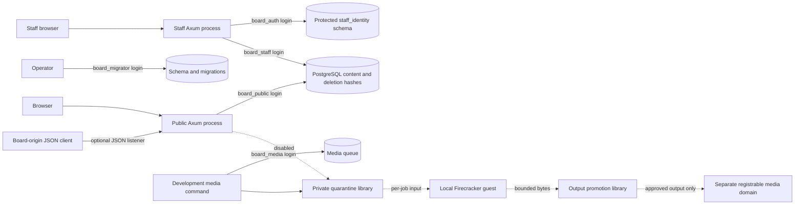

# Architecture and threat model

The implemented domain is a modular monolith: `board-domain` owns identifiers, posting validation and formatting; `board-config` validates origins and runtime configuration; `board-store` owns public and media queue SQL; `board-public` serves Axum routes and escaped Askama templates. An optional [JSON API listener](api.md) runs in that same public process with a restricted route surface and board-origin CORS. It shares the public pool, request budget and authority; it is not a new privilege boundary. `board-staff` is a separate Axum deployment with its own authentication and moderation SQL. `board-migrate` and `staff-operator` are operator binaries. First-party crates forbid unsafe Rust.

Dashed flows are not production service routes. The media library implements private quarantine and bounded-output promotion, and a separate media login owns a persisted queue. A [local Firecracker operator profile](firecracker.md) executes one guest independently of that queue. Public uploads, authenticated dispatch and fenced publication remain unfinished. No ordinary container is claimed to substitute for a microVM. See [media notes](media.md) for exact limits and remaining publication/crash concerns.

## Identities and authority

| Identity | Actual authority | Already-compromised component implications |
|---|---|---|
| Public application / `board_public` | Select content and deletion hashes; insert posts/reports; update thread counters/timestamps/deletion and post deletion; limited board row-lock grant | Can read retained deleted text and password hashes, corrupt public content, submit reports and consume its database resources. Cannot select staff/auth data or reports, update staff roles, assume migration identity, create schemas or read deployment settings. Those denials are tested against real PostgreSQL logins. |
| `board_migrator` | Database owner and schema maintenance, outside public runtime | Can change data/grants; never include it in either web service's environment. The migration CLI verifies its login. |
| Staff process / `board_staff` login | Read content/reports; update moderation columns; insert audit records and lock board rows | A compromised staff process can alter moderation state and fabricate audit entries through these grants. It cannot edit or delete existing audit records, read deletion hashes, change schema/deployment settings or administer roles. |
| Staff process / `board_auth` login | Read accounts/credentials/invitations; operate ceremonies and sessions; invoke narrowly scoped enrollment/counter functions | A compromised authentication process can read identities and issue sessions, including impersonating existing staff. It cannot create accounts, change roles, replace credential keys or read content through this login. The staff process holds both operational and authentication logins; their combined authority is its actual trust boundary. |
| Local per-job worker | Guest UID1000 receives one read-only input device and one bounded output device; no network interface, credentials, host directory share or management socket | Actual local probes test worker identity/environment, selected file/device/storage denials, network denial with healthy TCP/PostgreSQL controls, and bounded resource behavior. Production tier and remaining controls are unverified; see [execution evidence](verification-firecracker.md). |
| Local root runner and VMM | Operator-only utility creates a generated service/jail/tmpfs; VMM drops to `board-media-vmm`; no database access is needed | Root runner is part of the host trust base and must never become a general web-callable executor. Compromise of the guest grants its input/output authority; compromise of the host launcher grants host authority. Authenticated dispatch and production privilege separation remain required. |
| Development publication / `board_media` | Queue/asset approval metadata, configured private quarantine and output directories | Can corrupt or exhaust its queue and approve outputs. It has no complex decoder or subprocess launcher. Actual login tests deny content, deletion hashes, staff/deployment data, schema creation and migration role assumption. [Publication](media-approval.md) uses current-lease checks and a shared storage lock; deployment identity and power-loss qualification remain open. |
| Development media reader / `board_media_read` | Approved-only metadata view and read access to the configured private output directory | No queue, lease-token, pending-row or mutation grants. The reader checks approval, bounded length and digest before export. A compromised reader with directory read access could read pending files; filesystem confidentiality from that trusted reader is not claimed. No separately deployed HTTP media service exists yet. |
| Operator/backup/deployment identities | Outside application roles | Disposable backup/restore tested. Production backup immutability and release permissions have not been deployed. |

PostgreSQL grants are real and versioned. Runtime startup checks expected login names, administrative flags, memberships, ownership and forbidden schema authority. Staff account creation, role changes, revocation and recovery require the operator credential, which neither web runtime accepts. Authentication state is checked on every protected request; a revocation racing an already authorized request does not retroactively cancel that request. Schema separation does not replace staff authentication or deployment network policy. The development database binds loopback; it is not evidence of a production network boundary.

## Public mutation and rendering rules

Posting/deletion/reporting acquire a board row lock in a transaction. Replies inspect thread state while locked; sequence IDs and foreign keys preserve relationships. The reply limit counts accepted replies over the thread's life. `sage` suppresses a bump. OP deletion hides its replies atomically. A failed transaction is rolled back. A request timeout near commit may leave an accepted post; the response asks users to check before retrying. Posting idempotency keys are not implemented.

The public process decodes no media. Its only user-text grammar recognizes greentext lines, local numeric quotes, flat spoiler tags and HTTP(S) links without URL credentials. Rendering uses template macros over typed nodes; no `safe` filter or arbitrary HTML insertion is used. Staff previews use the same domain grammar and escaped Askama rendering. Filenames and worker metadata do not enter the public application because media is disabled. The separate media library accepts only a capped raw-pixel format and invokes a PNG encoder; its dependency also contains decoder APIs, which runtime code does not call.

JSON encodes comments through the same renderer. Mutable HTML/errors use `no-store`. JSON has representation-derived ETags with `max-age=0, must-revalidate`; deleted threads return 404 before validators are processed. Thread list/catalog previews fetch only bounded preview rows, while counts stay in SQL. Individual thread reads cap at the schema's 1,001 posts.

Board/index/catalog responses read board settings, selected thread metadata, visible counts and previews in one PostgreSQL `REPEATABLE READ, READ ONLY` transaction. This includes both JSON listeners and HTML board/catalog pages. The store validates pagination against the settings in that snapshot and releases the transaction before rendering. Three data queries serve count-only thread lists; preview responses add one query limited to the OP and at most five replies per selected thread. The schema caps selection at 1,000 threads. Existing handler deadlines and response admission still apply; this is consistency evidence, not a new aggregate memory or database execution-time guarantee. See [snapshot verification](verification-board-snapshots.md).

## Browser and network boundary

Public, staff and media origins must differ. Production origins require HTTPS and distinct public/staff hostnames because cookies do not respect port boundaries. Media must have a different registrable domain from both applications, checked using the pinned public suffix list dependency. Development exceptions require loopback hosts; use `localhost` for staff and `127.0.0.1` for public to keep local cookies separate. The public application sets no cookies. Staff cookies are host-only, HttpOnly and SameSite=Strict; production uses Secure and the `__Host-` prefix. WebAuthn ceremonies bind the configured staff origin and RP ID, require user verification and remain server-side. Hardware attestation is not enforced.

POST requires the exact configured Origin and rejects inappropriate Fetch Metadata. Staff moderation also requires a session-bound CSRF token and authentication within ten minutes. Referrer policy is `same-origin` so native form submissions retain their origin signal while external navigation receives no referrer. Public CSP permits local styles and forms and prohibits scripts, objects, framing and media. Staff CSP additionally permits its local WebAuthn script and same-origin fetches. CSP supplements escaped rendering.

Forwarded headers are ignored. Rate limits use the socket peer, with at most 10,000 transient entries and 30 writes per peer per minute. A reverse proxy therefore shares one bucket unless an authenticated proxy design is implemented. Do not claim client-IP fairness behind a proxy. Public form bodies are limited to 256 KiB to accommodate percent-encoded UTF-8 comments; the JSON-only listener retains 64 KiB. Comments are bounded to the board's Unicode scalar limit, at most 16,000 scalars and 64,000 bytes, in validation and PostgreSQL. The parser independently caps scalar input. Handler deadline is 10 seconds, admission capacity 32 and Argon2 concurrency 4. Public/API admission is retained through application response bodies and their emitted data, including clones and slices; middleware finalizes ownership after body transformations. Staff uses the same ownership utility with its independent capacity of 16. Empty responses release immediately; dropping responses or their completed data frees capacity. This does not bound kernel buffers, downstream copies, small overload replies or connection/write duration. Larger comments increase possible aggregate response memory; row limits alone do not qualify that budget. The candidate service file adds external CPU/memory/process ceilings; those service-level ceilings have not been tested on a production host.

Staff uses a separate process-wide limit of 30 enrollment/login starts per minute, 16 concurrent requests, a ten-second handler deadline, five live ceremonies and ten live sessions per account. Database acquisition is bounded. These are local protections, not distributed abuse controls. Staff sessions have an eight-hour absolute lifetime and a configurable inactivity deadline (15 minutes by default), atomically enforced in PostgreSQL. Activity does not renew the ten-minute authentication window for mutations. Production hardware/recovery-policy validation remains open. See [staff operations](staff.md), including coordinated timeout changes and migration rollout.

## Media containment acceptance required later

Use a maintained isolated guest on a dedicated processing tier after reviewing [Firecracker production guidance](https://github.com/firecracker-microvm/firecracker/blob/main/docs/prod-host-setup.md). Presence of `/dev/kvm` in WSL is not a deployment qualification. Pin and review the host kernel, runtime, guest kernel/rootfs and decoder versions before enabling processing.

For a deployed owned test job, prove absence of database/deployment secrets and host sockets; access only one job's input/output; deny DNS, metadata, internal services and Internet paths; verify CPU/memory/process/disk/output/time ceilings from outside the guest; kill the full job and dispose of its workspace. Each negative connectivity test needs a healthy reachable positive control from an allowed context. Then test malformed but harmless output against a narrow byte/metadata protocol and idempotent promotion. The [local profile](firecracker.md) covers a recorded subset; remaining deployed controls stay prerequisites.
